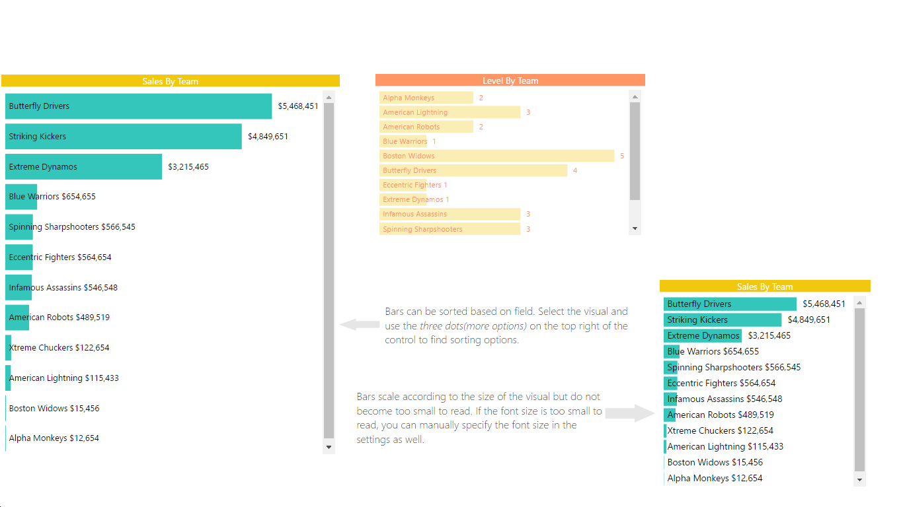

# Horizontal bar chart

> A horizontal bar chart that saves space by putting the category labels inside the bars



# Overview
This horizontal bar chart visual can be used as a filter to slice through your data in a more meaningful fashion while saving space by putting the category labels inside the bars itself. You can add different tooltips to show next level of detail that you don’t want visible right on the first look but still is relevant to the dataset.

See also [Horizontal bar chart at Microsoft AppSource](https://appsource.microsoft.com/en-us/product/power-bi-visuals/WA104381230)

# Development Workflow

```bash
npm i # installs all required modules
npm run cert # generates and installs a SSL certificate
npm start # starts debugging visual
npm run package # build a pbiviz package for Power BI
```